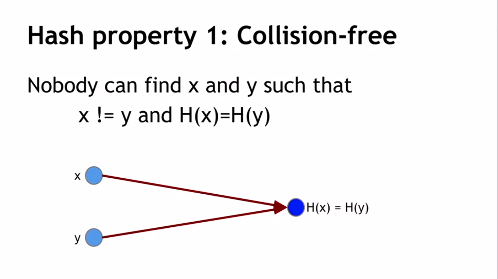
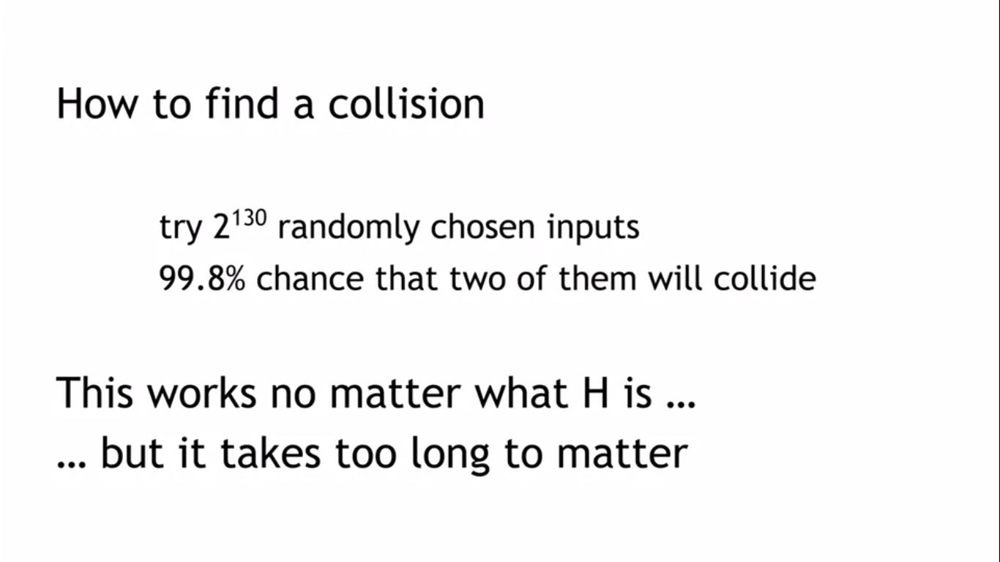
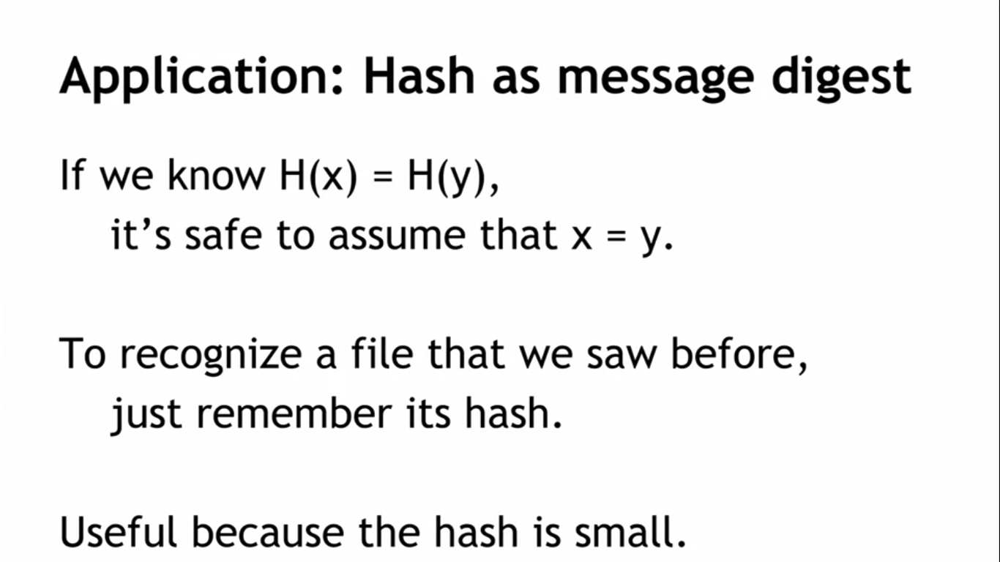
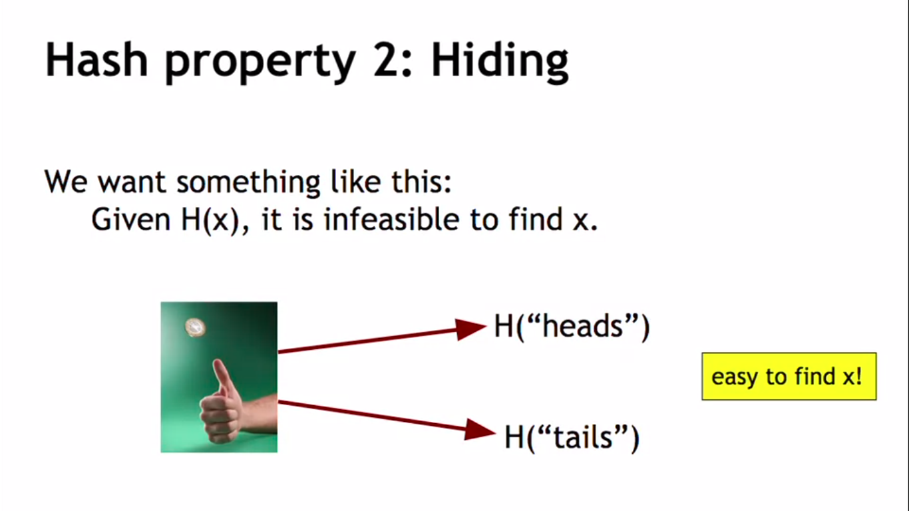
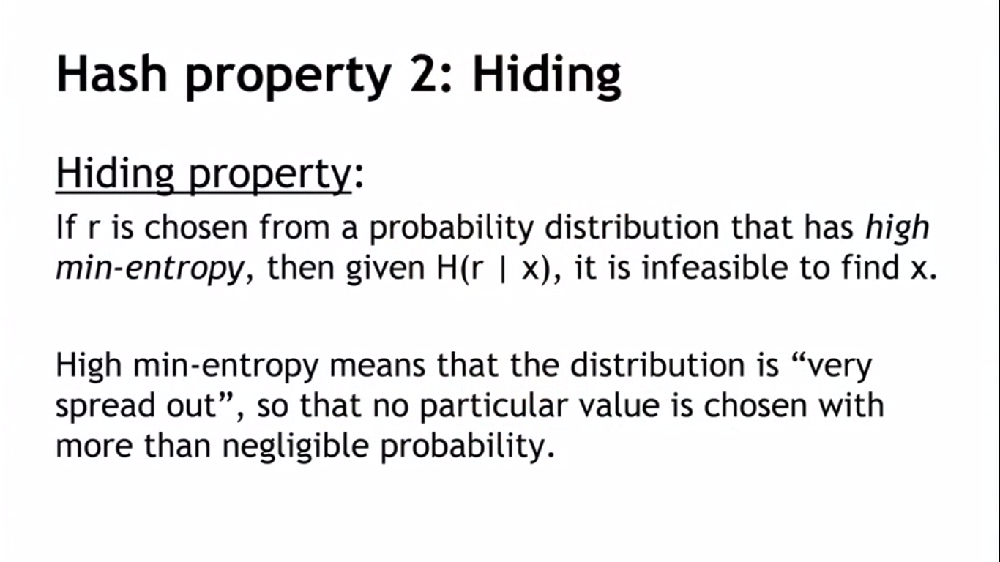
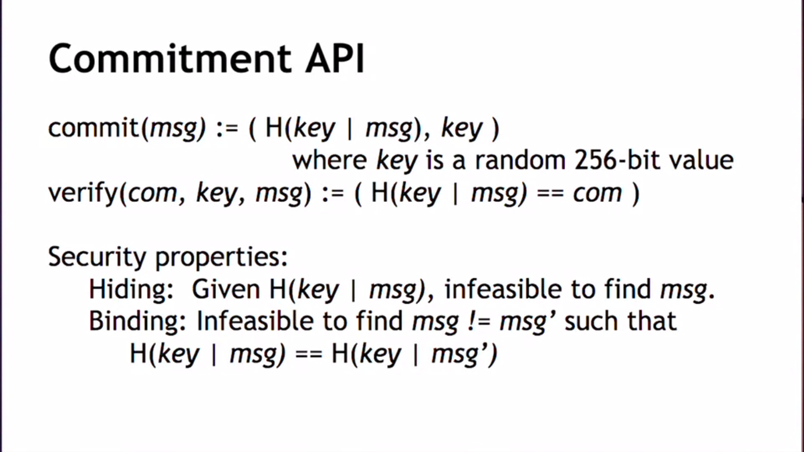
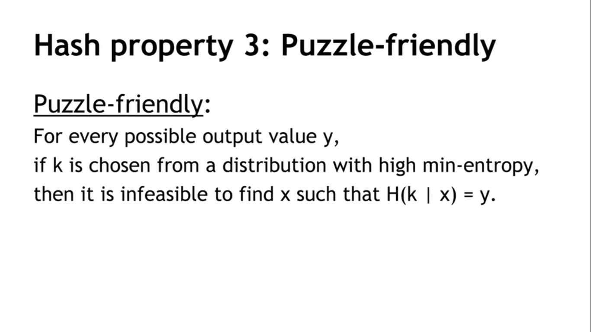

## Cryptographic Hash Functions
### Hash function:
* takes any string as input
* fixed-size output (256 bits like Bitcoin)
* efficiently computable

### Security properties:
* collision-free
* hiding
* puzzle-friendly

It's possibly to find collisions because there are lots of input and much less outputs (Different inputs map to one output)

### Real world example

<i> Problem here - easy to find x, because you   need to find hashes of two string and compare to hash of our function.</i>

So

