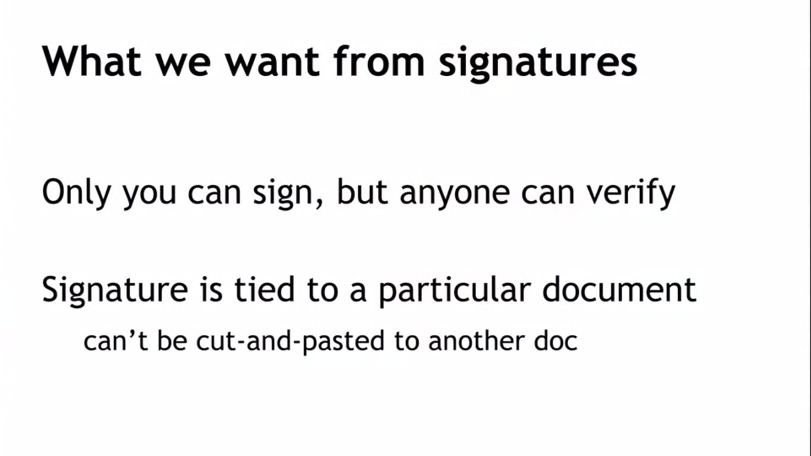
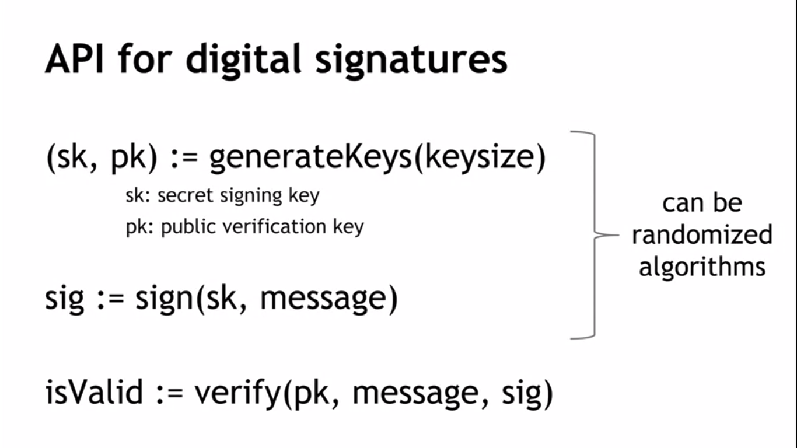
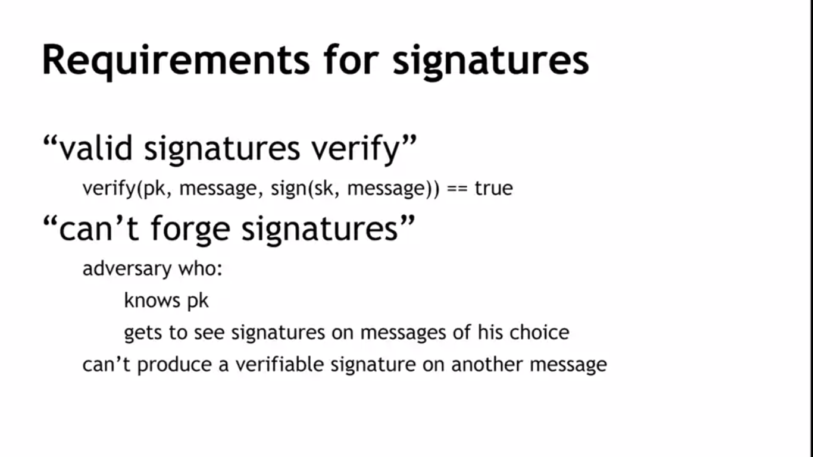
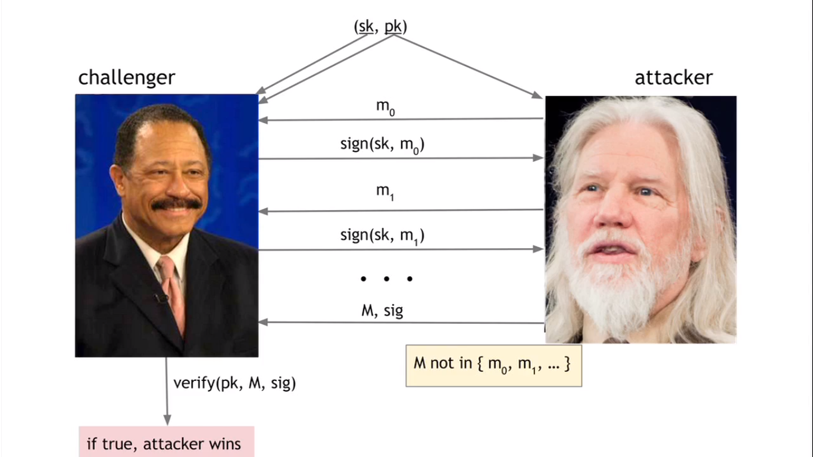
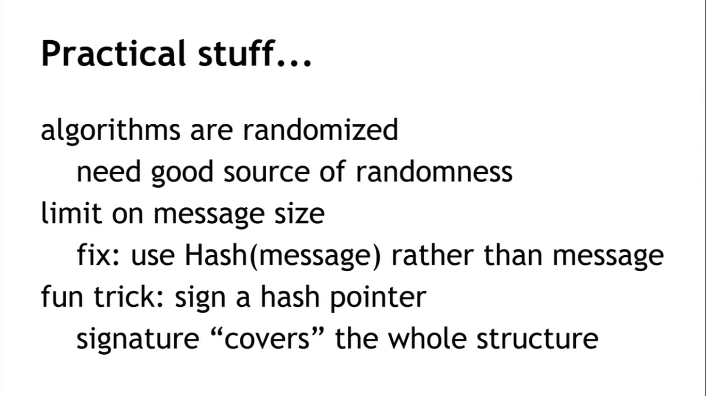

## Digital Signatures

#### But how we can turn it into digital form?

#### What is really means "can't forge signatures"? It's easy to understand after looking at image below.

Both have public key. The attacker sends different messages and gets the sign of each document. And he's going to send over what he claims is a signature on that message. The challenger is going to run the verify algorithm, use the public verification key on that message, and the signature that the attacker provided, and is going to check whether it verifies. And if it does verify, if this returns true, then the attacker wins, the attacker has forged a message.

#### In other words we want to make the attacker chances to be neglected.

## Practical part

### Bitcoin uses [ECDSA](https://uk.wikipedia.org/wiki/Elliptic_Curve_Digital_Signature_Algorithm) standart,  relies on hairy math and good randomness is essential!
