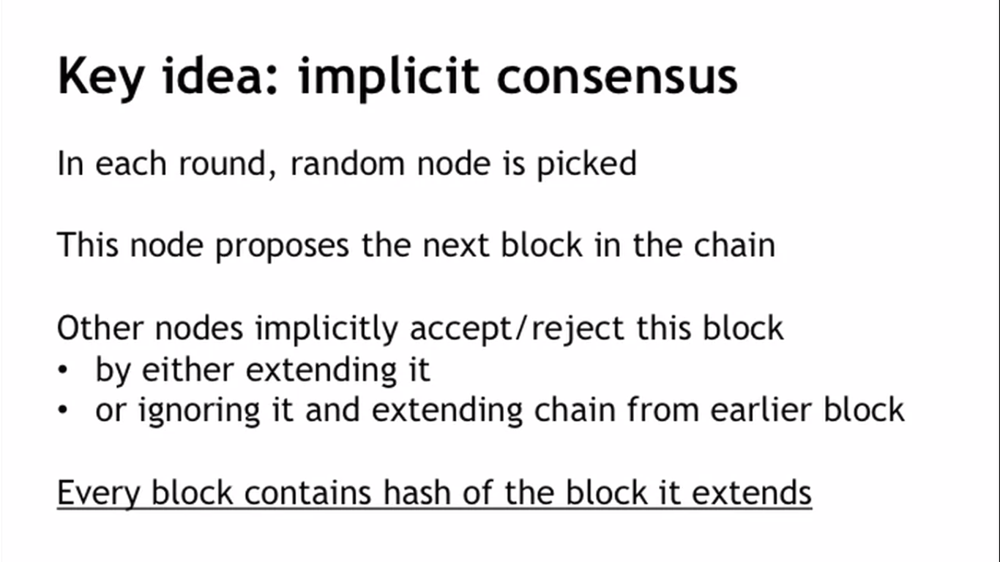

## Consensus without identity: Block Chain
### Reasons to have identity in distributed systems 

### But why don't bitcoin nodes have identities?
1. Identity is hard in peer-to-peer networks - [Sybil attack](https://en.wikipedia.org/wiki/Sybil_attack)
2. [Pseudonymity](https://www.buybitcoinworldwide.com/anonymity/) is a goal of bitcoin. 

### To understand: Let's see how attacker can break this algorithm (Double-Spending attack)
1. From attacker's point of view

* Honest block - green
* Malicious block - red
* The attacker changes destination address to his own address. From our prospective we choose honest block over malicious, but from techinal view there is no difference between these two blocks. So, if this malicious block is selected, we can say that double-spending attack was successful.

2. Let's see from receiver's point of view

#### Here's two options:
1. Bob(receiver) hear about this transaction and he can approve it without confirmations.
2. He could wait for 1 confirmation. There could be an attempt at a double-spending attack. But if it's tree Bob can abandon this transaction. 

