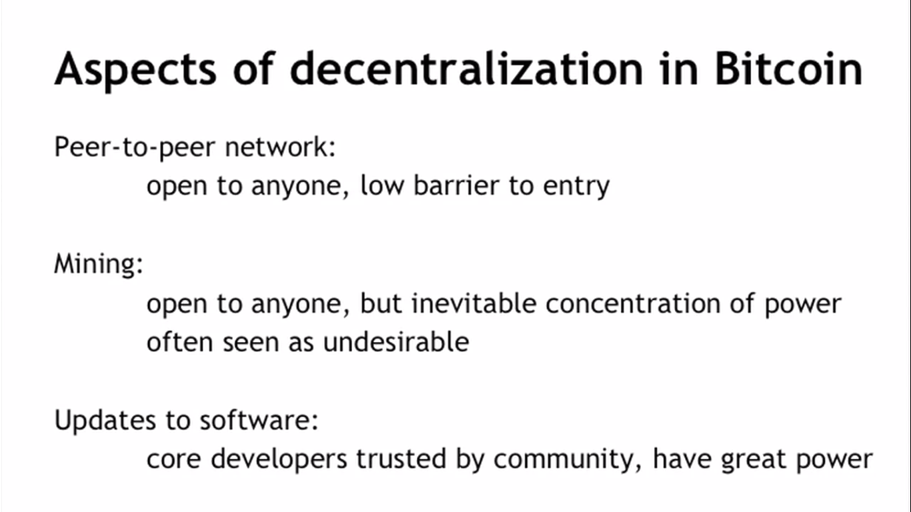
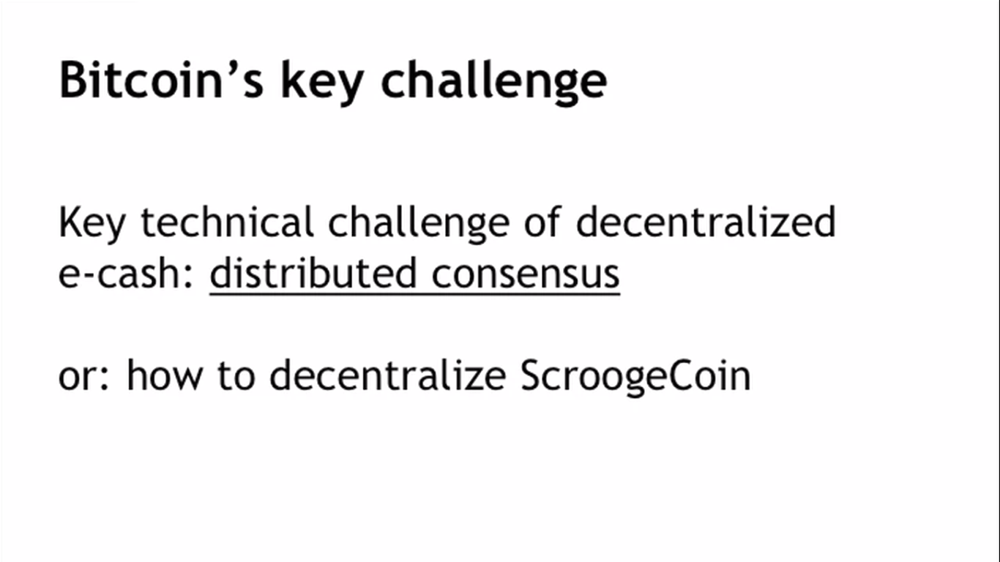
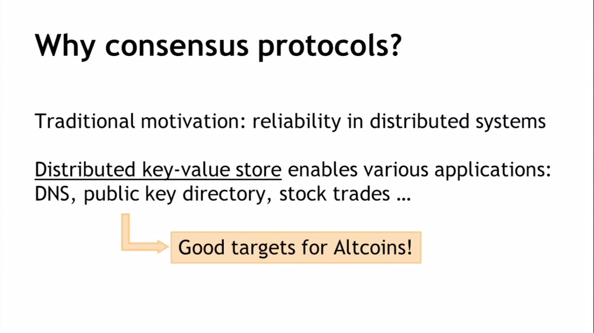
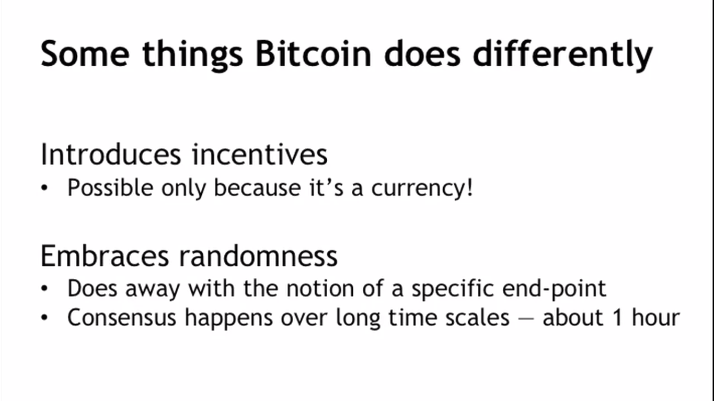

## Centralization vs. Decentralization

### 1. Competing paragidms that underlie many digital technologies. 
### 2. Decantralization is not all-or-nothing.
E-mail: 
decentralized protocol, but dominated by centralized webmail services.

## Distributed Consensus

### Defining distributed consensus
1. The protocol terminates and all correct nodes decide on the same value
2. This value must have been proposed by some correct node  

