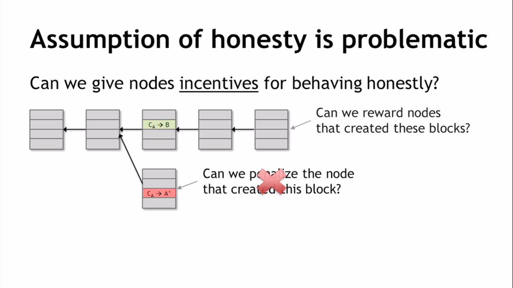
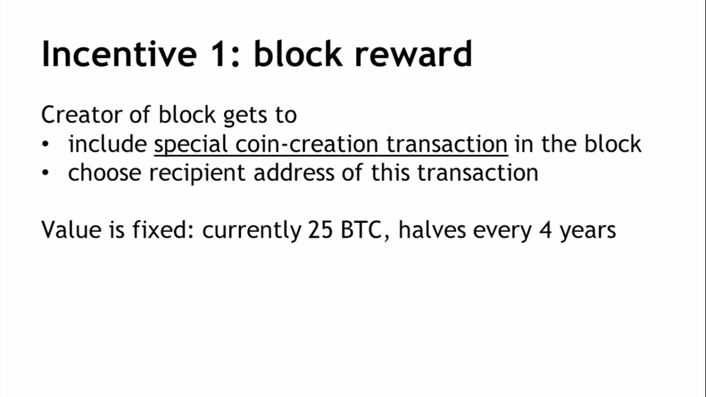
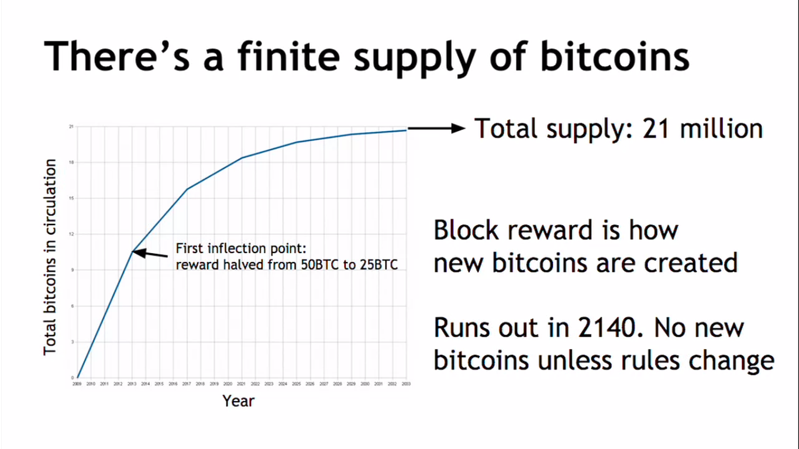
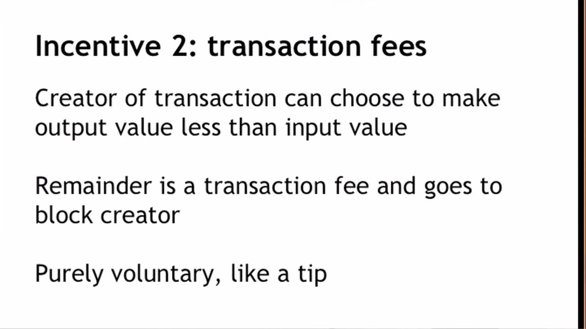
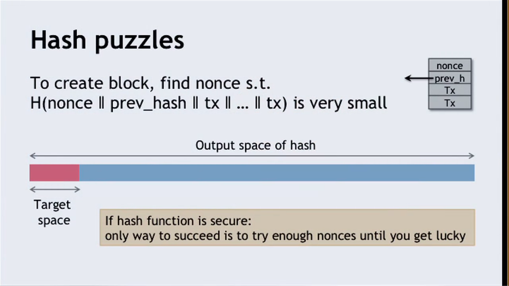

## Incentives and Proof of Work

Yes, we can reward the honest nodes to pay it bitcoin.

* Block creator gets to "collect" the reward only if the block ends up on long-term consensus branch!

### So, there is another incentive

### Remaining problems 
1. How to pick a random node?
2. How to avoid free-to-all due to rewards?
3. How to preven the Sybil attack?

### Solution to all problems - Proof of Work
* #### To approximate selecting a random node:
    * Select node in proportion to a resource that no one can monopolize (we hope)

* In proportion to compute power - Proof of Work.
* In proportion to ownership - Proof of Stake.

1. Pow property 1: difficult to compute
2. Pow property 2: parameterizable cost.
    * Prob(Alice wins next block) = fraction of global hash power she controls
